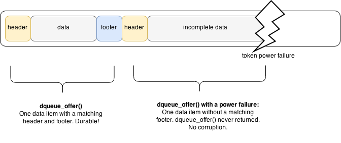

*WARNING: Experimental - Don't use me in PROD*

Dead simple queue that allows zero copy semantics and is durable under failure.

How?
----
We read and write to the underlying binary file using mmap.
We use a second mmap to create a mirror of the buffer so that the caller doesn't need to fool around with pointer arithmetic + buffer boundaries.

Durability
----------
1. dqueue_offer() returns only when the item has been msync()'d. 
2. Because we write a header and footer for each item, the non-existence of the footer indicates the item wasn't completely written to disk.

Why?
----
A frontend process provides durability with minimal latency, while a backend process does processing of the queue.

Example
-------
.. code-block:: bash

    void *qu = dqueuew_open("tmp.queue", 1 << 13);
    dqueue_offer(qu, "abcd", 4);
    dqueue_poll(qu);

Tradeoffs
---------
* Multiple writers/readers aren't possible. It isn't thread safe. You should just create multiple queues.
